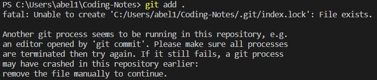

?> Git 常用命令

## git remote 远程仓库

查看关联的远程仓库名称

```
git remote
```
查看关联的远程仓库详细信息

```
git remote -v
```
查看关联的远程仓库详细信息

```
git remote -v
```

添加远程仓库的关联

```
git remote add <name> <url>
```

删除远程仓库的关联

```
git remote remove <name>
```

修改远程仓库的关联

```
git remote set-url <name> <url>
```

## Another git process seems to be running in this repository

执行 `git commit -a` 在 VIM 界面输入信息时终端崩溃，再次执行 `git commit` 命令报以下错误



!> 进入 `.git/` 目录，手动删除 `index.lock` 以及 `.COMMIT_EDITMSG.swp`

## 代码高亮测试

```html
<!-- Site theme -->
<link rel="stylesheet" href="https://unpkg.com/docsify-themeable/dist/css/theme-defaults.min.css">

<!-- PrismJS theme -->
<link rel="stylesheet" href="path/to/prismjs-theme.css">
```